# 🚀 GenMark

## 📌 Table of Contents

- [About the Project](#about-the-project)
- [Demo](#demo)
- [Features](#features)
- [Tech Stack](#tech-stack)
- [Screenshots](#screenshots)
- [Getting Started](#getting-started)
  - [Installation](#installation)
  - [Running Locally](#running-locally)
- [Usage](#usage)
- [Project Structure](#project-structure)
- [Contributing](#contributing)
- [License](#license)
- [Contact](#contact)

---

## 📖 About the Project

GenMark (Generative Marketing) is an AI-powered advertising content creation and management platform designed for marketers, agencies, and organizations. Harnessing advanced GenAI and intelligent agents, GenMark enables users to effortlessly generate, organize, and deploy high-quality ad content across multiple channels. With secure authentication, intuitive dashboards, and support for diverse content types, GenMark streamlines the entire ad creation workflow—empowering companies and institutions to rapidly produce compelling campaigns and maximize their advertising impact while significantly reducing costs.

---

## 🔗 Demo

_Live Demo: [https://gen-mark.vercel.app/](https://gen-mark.vercel.app/)_

---

## ✨ Features

- Robust user authentication with secure signup and login
- AI-driven ad creation: generate text, images, and videos instantly
- Intuitive ad management: create, edit, delete, and organize campaigns
- Seamless file uploads with secure cloud storage
- One-click email ad distribution to target audiences
- Various templates for rapid campaign launch
- Clean, responsive UI for a smooth cross-device experience
- Easily customize and edit generated content to meet user requirements

---

## 🛠 Tech Stack

**Frontend:**

- React
- Tailwind CSS
- shadcn/ui
- lucid-react

**Backend:**

- FastAPI
- MongoDB
- GridFS
- Motor
- JWT for Authentication
- Smtplib
- Passlib

**AI:**

- Langgraph
- LLMs:
  - Gemini-2.5-flash
  - llama-3.1-8B-instant
  - Predis-api
- Pillow
- Pandas

**Deployment:**

- Vercel (Frontend)
- Render (Backend)
- Uptime Robot (Monitoring)

---

## 📸 Screenshots

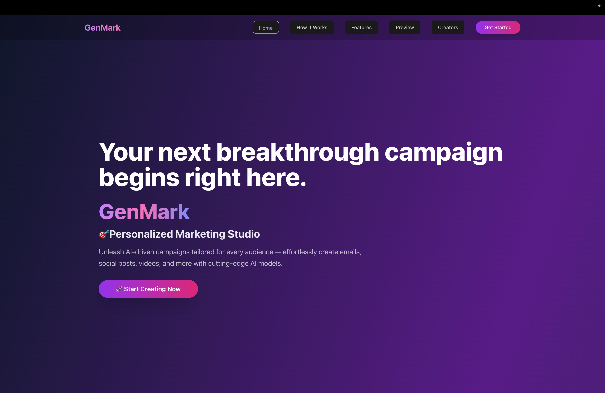
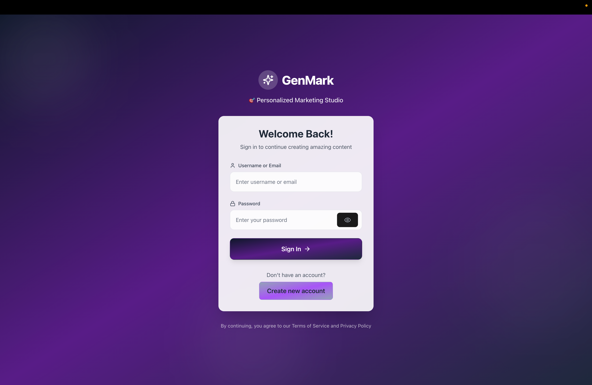
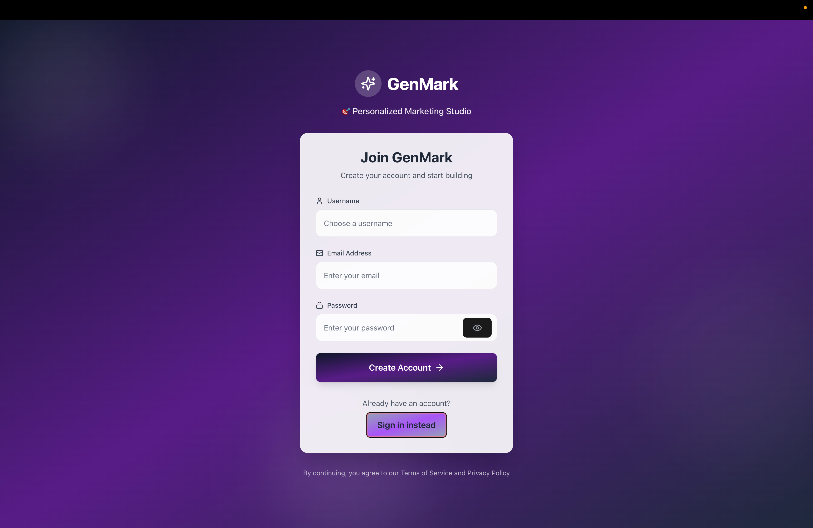
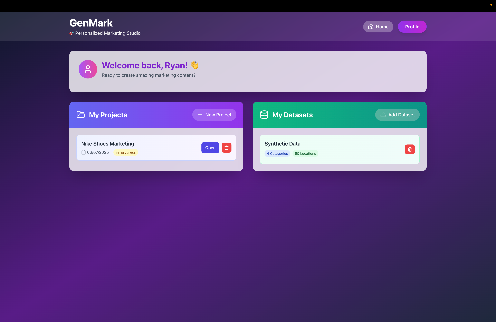
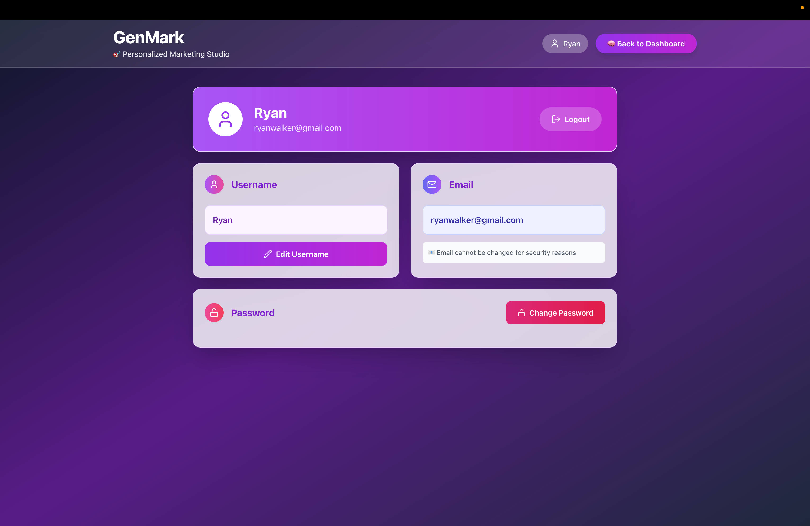
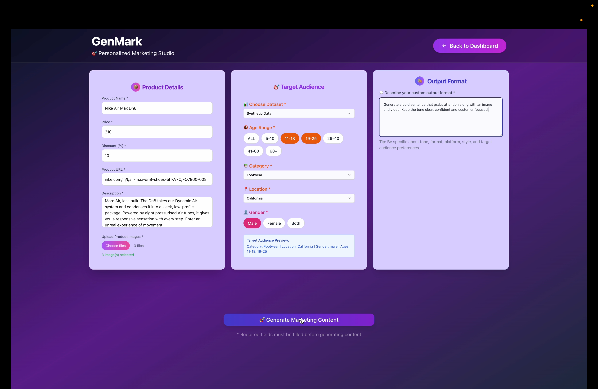
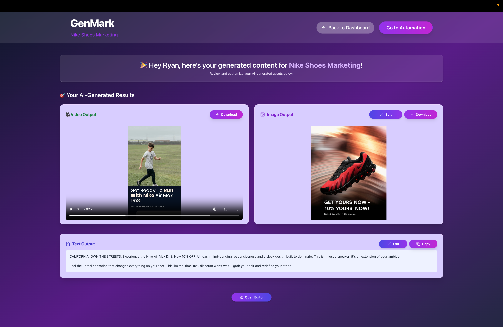
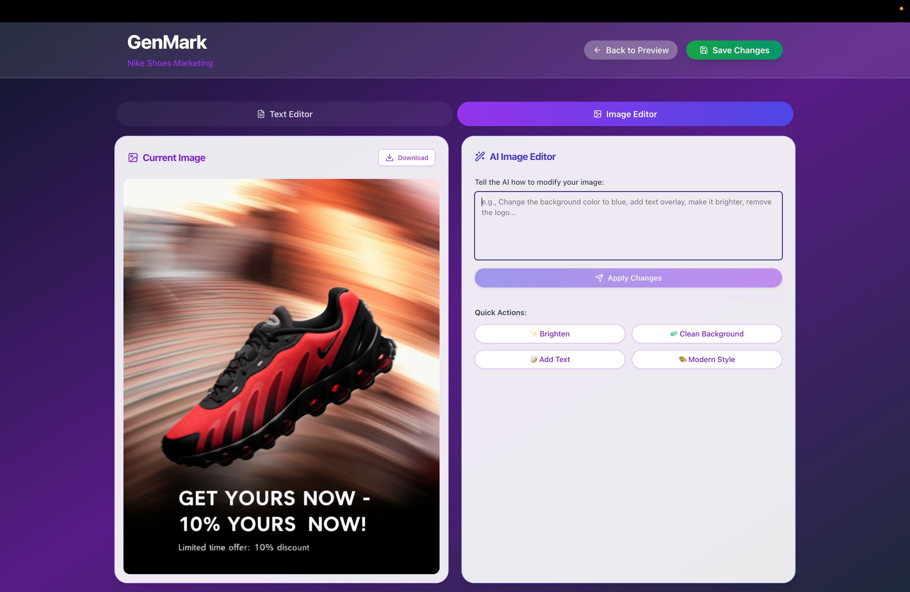
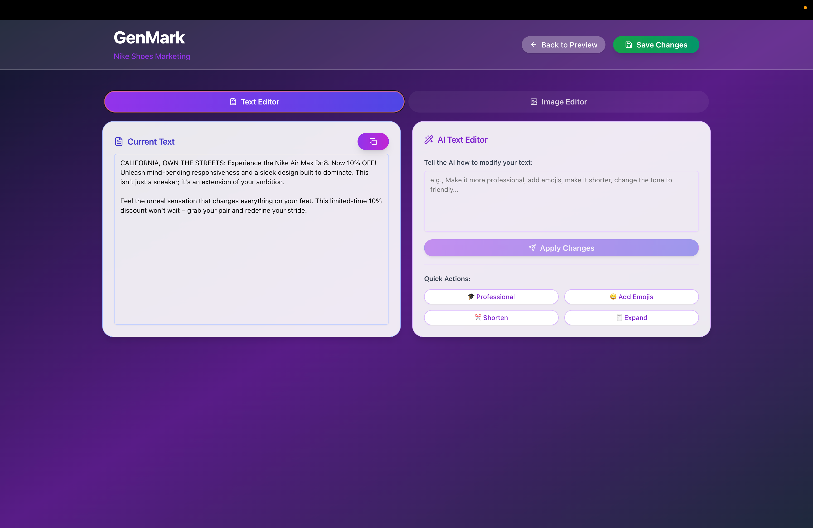
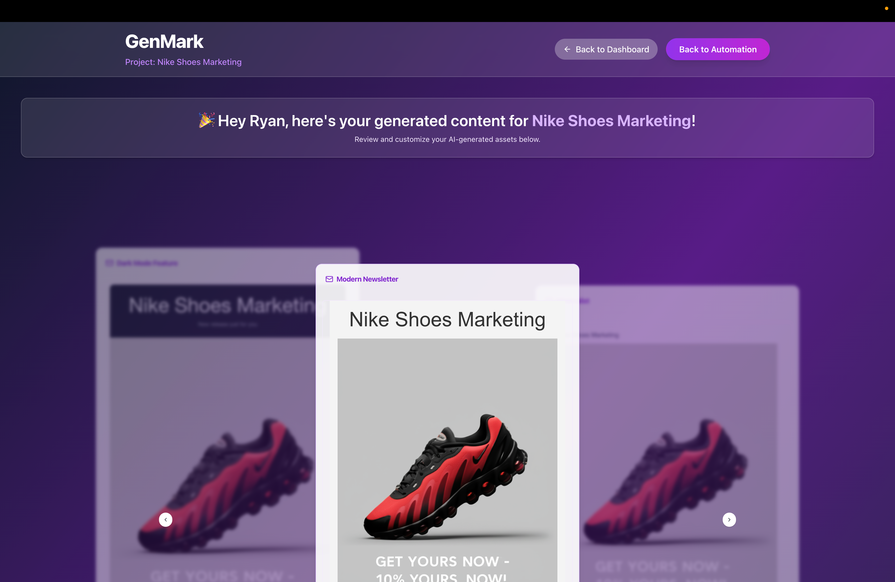
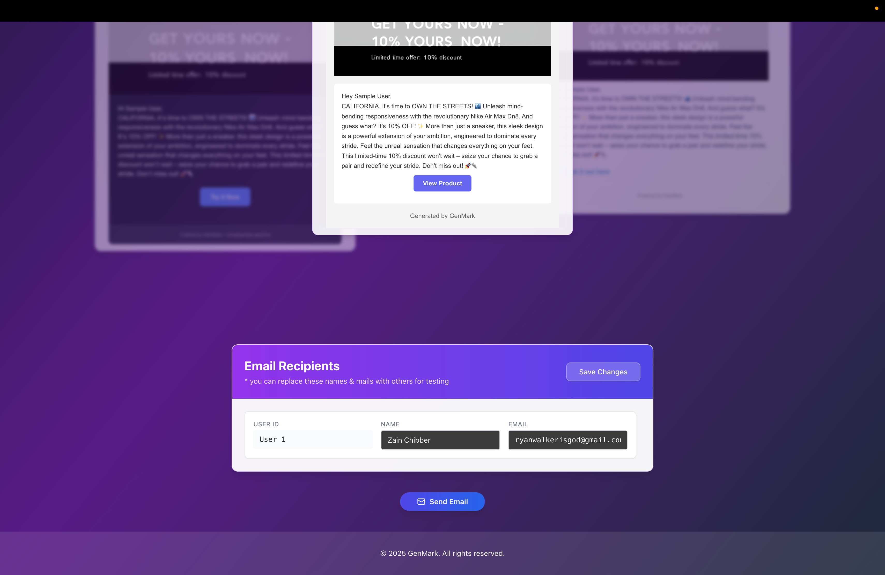

---

## ⚙️ Getting Started

### 📥 Installation

Clone the repository:

```bash
git clone https://github.com/984-ISHU/GenMark.git
cd GenMark
```

### 🔧 Frontend Setup

```bash
cd frontend
npm install
npm run dev
```

### ⚙️ Backend Setup

```bash
cd backend
pip install -r requirements.txt
uvicorn app.main:app --reload
```

### 🌐 Environment Variables

Create a `.env` file in `backend` directories with required credentials:

```env
# Example for backend
MONGO_URL=
GROQ_API=
GOOGLE_API_KEY=
SECRET_KEY=
PREDIS_BRAND_ID=
PREDIS_API_KEY=
APP_PASSWORD=
SENDER_EMAIL=
```

---

## 💡 Usage

1. Register and log in with your credentials.
2. Upload a CSV file in the accepted format via the dashboard.
3. Create a new project, specifying product details, target audience, desired output format (text, video, or image), and content preferences.
4. Initiate content generation and wait approximately 90 seconds for the AI to produce the requested assets.
5. Access and download the generated content directly from the preview page.
6. Customize generated images and text by submitting tailored prompts; save the refined outputs as needed.
7. Proceed to the automation page to select from a range of email templates and automatically send advertisements to the customer list provided in your CSV, enabling streamlined email marketing.

---

## 🗂 Project Structure

```plaintext
/
├── static/
├── backend/
│   ├── app/
│   │   ├── routes/
│   │   │   ├── dataset.py
│   │   │   ├── edit_output.py
│   │   │   ├── generatedoutput.py
│   │   │   ├── project.py
│   │   │   ├── send_email.py
│   │   │   ├── user.py
│   │   ├── __init__.py
│   │   ├── db.py
│   │   ├── main.py
│   │   ├── model.py
│   ├── GenAI/
│   │   ├── Edit/
│   │   │   ├── __init__.py
│   │   ├── Langgraph.py
│   ├── .env
│   ├── requirements.txt
├── frontend/
│   ├── node_modules/
│   ├── src/
│   │   ├── auth/
│   │   │   ├── AuthContext.jsx
│   │   │   ├── ProtectedRoute.jsx
│   │   ├── components/ui/
│   │   ├── lib/
│   │   │   ├── api.js
│   │   │   ├── utils.js
│   │   ├── pages/
│   │   │   ├── Automation.jsx
│   │   │   ├── Dashboard.jsx
│   │   │   ├── Editor.jsx
│   │   │   ├── Home.jsx
│   │   │   ├── Login.jsx
│   │   │   ├── Preview.jsx
│   │   │   ├── Profile.jsx
│   │   │   ├── Project.jsx
│   │   ├── App.jsx
│   │   ├── index.css
│   │   ├── main.jsx
├── static/
│   ├── Home.png
│   ├── Login.png
│   ├── Register.png
│   ├── Dashboard.png
│   ├── Profile.png
│   ├── Project-Page.png
│   ├── Preview-Page.png
│   ├── Image-Edit.png
│   ├── Text-Edit.png
│   ├── Automate-1.png
│   ├── Automate-2.png
├── .gitignore
├── components.json
├── eslint.config.js
├── index.html
├── jsconfig.json
├── package-lock.json
├── package.json
├── postcss.config.js
├── tailwind.config.js
├── vercel.json
├── vite.config.js
.gitignore
package-lock.json
package.json
README.md
```

---

## 📝 License

This project is licensed under the MIT License - see the [LICENSE](LICENSE) file for details.

---

## 📬 Contact

Created by Karan and Ishaan  
Email: [karanjadhav2003@gmail.com](mailto:karanjadhav2003@gmail.com), [ishux984@example.com](mailto:ishux984@example.com)  
LinkedIn: [karanjadhav2003](https://www.linkedin.com/in/karanjadhav2003/), [ishu-garg](https://linkedin.com/in/ishu-garg)

---
